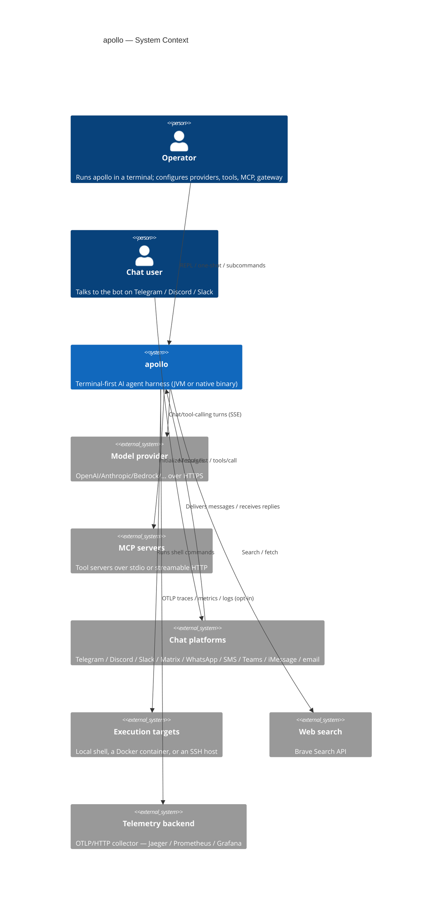
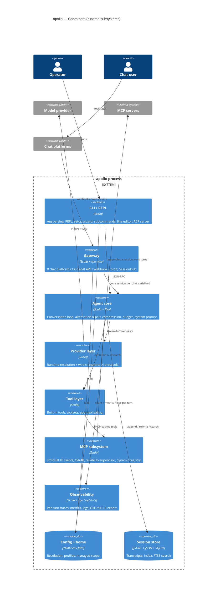
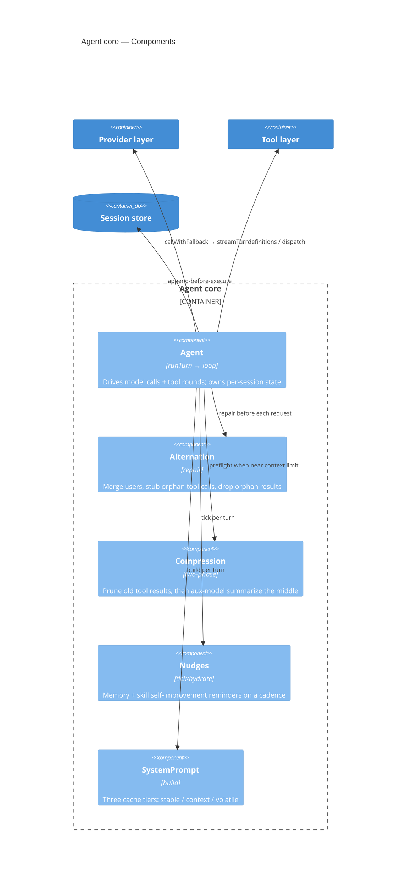
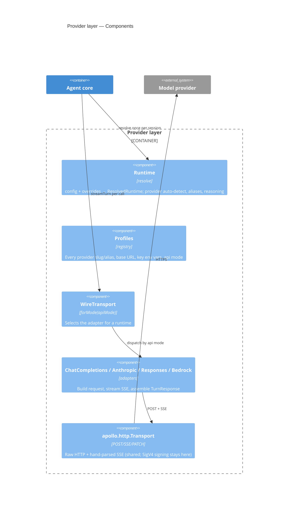
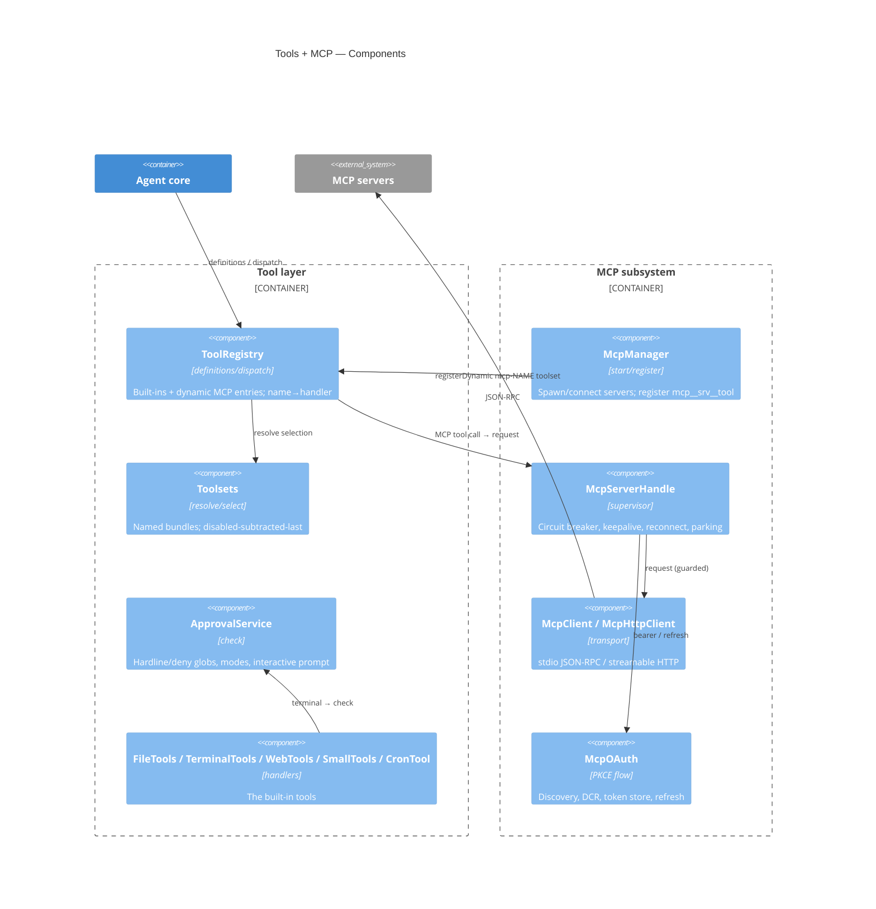
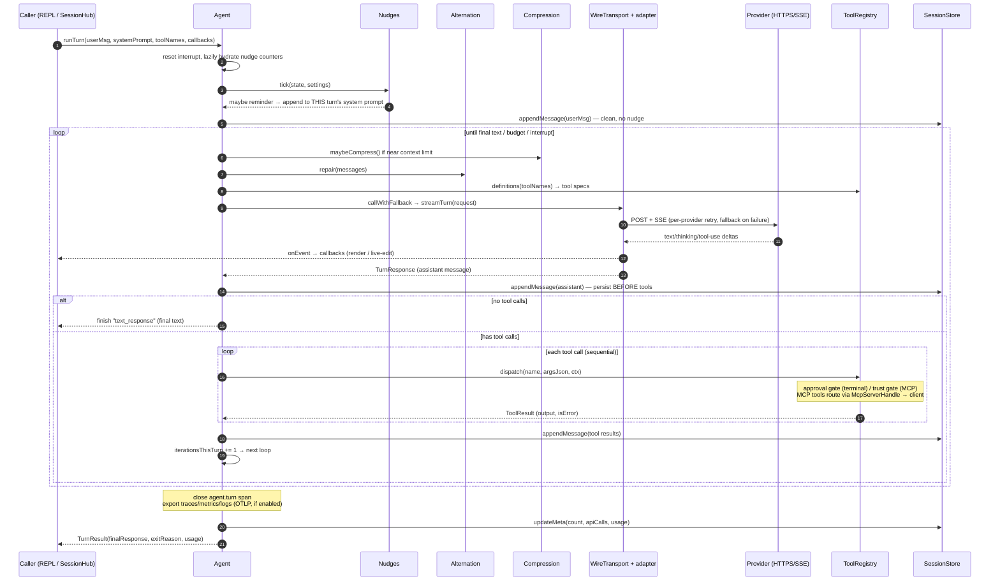

<!--
SPDX-FileCopyrightText: 2026 David Greco <greco@acm.org>

SPDX-License-Identifier: Apache-2.0
-->

# apollo — Architecture

This document describes apollo's architecture using the [C4 model](https://c4model.com/)
(System Context → Containers → Components → Code), the cross-cutting design
choices, and then a **detailed, step-by-step walkthrough of what happens when a
prompt is received**.

apollo is a **single program** (one JVM process, or one native binary) with two
run modes: an interactive/one-shot **CLI**, and a long-running **gateway**. It is
not a distributed system — the C4 "containers" below are the major runtime
subsystems *inside* that one deployable, which is the useful decomposition here.

> Diagrams use Mermaid (including its C4 dialect). If your viewer doesn't render
> them, the prose beside each one is self-contained.

---

## C4 Level 1 — System Context

Who uses apollo and what it talks to.



- The **operator** drives apollo directly (REPL, `-z` one-shot, subcommands like
  `apollo mcp`, `apollo gateway`).
- **Chat users** never touch apollo directly; they message a bot on a chat
  platform, and the gateway relays to/from the agent.
- Everything external is reached over the network (providers, MCP HTTP, chat
  platforms, Brave) or as a child process (stdio MCP, the `terminal` tool's
  local/docker/ssh execution).

---

## C4 Level 2 — Containers (subsystems of the one process)



| Container | Package(s) | Responsibility |
|---|---|---|
| **CLI / REPL** | `apollo.cli`, `apollo.Main`, `apollo.acp` | Parse args, dispatch subcommands, run the REPL or one-shot, host the setup wizard and (platform-split) line editor. Also hosts the **ACP** server (`apollo acp`) for editor integration (VS Code / Zed / JetBrains). |
| **Gateway** | `apollo.gateway` | Host chat connectors (Telegram, Discord, Slack, Matrix, WhatsApp, SMS, Teams, iMessage, email) + HTTP API + webhook + cron in one `Async.gather`; `SessionHub` owns one agent per conversation, serialized by a per-session mutex. |
| **Agent core** | `apollo.agent`, `apollo.core` | The conversation loop and its invariants: alternation repair, persist-before-execute, retries + fallback, compression, loop guards (repetition / empty-response), nudges, auto-checkpoint, background auto-review, system-prompt assembly. |
| **Provider layer** | `apollo.provider` | Resolve `config` → a `ResolvedRuntime`; translate the internal message model to/from each provider's wire format; sign (SigV4), stream (SSE), retry. `copilot`/`qwen` OAuth brokers live here. |
| **Tool layer** | `apollo.tools` | The built-in tool registry, toolset resolution, and the shell-command approval gate. Includes browser (CDP), computer-use, voice/image/video, checkpoints, kanban, and the **LSP** client tool (`apollo.lsp`). |
| **MCP subsystem** | `apollo.mcp` | Spawn/connect MCP servers, OAuth, keep them alive (reliability ladder), register their tools dynamically, and serve server→client **sampling / elicitation** requests. |
| **Observability** | `apollo.obs` | A content-free per-turn trace tree (`agent.turn → llm.call → tool.*`), cumulative metrics (`kyo-stats` histograms + counters), and structured logs (`kyo.Log`); `/trace` + `/metrics` in the REPL and fire-and-forget OTLP/HTTP export. |
| **Config + home** | `apollo.config` | Home/profile resolution, env layering, YAML parsing, managed scope, `${VAR}` expansion, secret-source resolution, build metadata. |
| **Session store** | `apollo.session` | JSONL transcripts + a JSON index under `scala-state/`; FTS5 search on the JVM, transcript scan on Native. |
| **HTTP client** | `apollo.http` | `Transport` (POST/SSE/PATCH/GET, hand-parsed SSE) and `HttpError`. Used by *every* subsystem that speaks HTTP — providers, MCP, chat connectors, CDP, skills, OTLP — so it sits below all of them rather than inside the provider layer. |
| **Kernel** | `apollo.util`, `apollo.core` | Pure data and pure functions: the conversation model (`Message`/`Content`/`Usage`), JSON helpers (`Jx`), SSE and eventstream decoders, UTF-8 chunking, portable crypto, ANSI styling. Depends on nothing else in apollo and uses no Kyo effect. |

---

## C4 Level 3 — Components

### Agent core



- **`Agent`** holds the mutable per-session state (`messages`, usage counters,
  nudge counters, resolved fallback runtimes) and runs the loop.
- **`Alternation`** enforces the strict user/assistant/tool ordering providers
  require, repairing the history before every request.
- **`Compression`** implements the two-phase context reduction (no-LLM prune →
  aux-model summary) with head/tail/last-user protection.
- **`Nudges`** is a pure decision function; the `Agent` holds its `State`.
- **`SystemPrompt`** assembles the cache-friendly three-tier prompt.

### Provider layer



### Tool layer + MCP



- `ToolRegistry` is the single dispatch point; **MCP tools are registered
  dynamically** as `mcp__<server>__<tool>` and dispatch identically to
  built-ins, but their handler routes through `McpServerHandle` (the reliability
  supervisor) → the live `McpClient`/`McpHttpClient`.
- The `terminal` tool is the only built-in that consults `ApprovalService`;
  MCP tools on an `untrusted` server are gated similarly inside their handler.

---

## C4 Level 4 — Code (key types)

The internal contracts everything else is expressed in:

```scala
// The wire-agnostic conversation model (apollo.core.Model) — we own this,
// so it derives Schema for persistence.
enum Role: case System, User, Assistant, Tool
enum Content:
  case Text(text: String)
  case Thinking(text: String, signature: Maybe[String])
  case ToolUse(id: String, name: String, arguments: String)  // args = raw JSON string
  case ToolResult(toolUseId: String, output: String, isError: Boolean)
  case Image(mediaType: String, base64: String)
final case class Message(role: Role, content: List[Content], timestamp: Maybe[String])

// One turn handed to a wire transport (apollo.provider).
final case class TurnRequest(runtime: ResolvedRuntime, systemPrompt: String,
                             messages: List[Message], tools: List[ToolSpec])
final case class TurnResponse(message: Message, stopReason: StopReason, usage: Usage)

// A provider protocol is a callback-shaped streamer (apollo.provider).
// It fails with the shared transport error (apollo.http), not a provider-specific one.
trait WireTransport:
  def streamTurn(req: TurnRequest)(onEvent: StreamEvent => Unit < (Sync & Async))
      : TurnResponse < (Sync & Async & Abort[HttpError])

// A registered tool (apollo.tools). MCP tools are ToolEntry values too.
final case class ToolEntry(name: String, toolset: String, description: String,
                           parametersJson: String, emoji: String,
                           available: ToolContext => Boolean,
                           handler: (Structure.Value, ToolContext) => ToolOutcome < (Sync & Async))
```

**Effect signatures.** Nearly everything returns `A < (Sync & Async & …)` — Kyo's
pending computation of `A` with the effect row `…`. `Sync` = side effects,
`Async` = fibers/concurrency, `Abort[E]` = typed failure. This is why "call the
model," "spawn a subprocess," and "wait for a callback" compose without callbacks
or `Future`.

---

## Cross-cutting design

- **Wire-format boundary.** Provider and MCP adapters build/parse JSON as
  `Structure.Value` (Kyo's dynamic JSON tree, via the `apollo.util.Jx` helpers)
  because those contracts are *externally owned*. Internal domain types
  (`Message`, `SessionMeta`, …) `derives Schema` because *we* own their on-disk
  form.
- **Hand-parsed SSE.** POST + `text/event-stream` is decoded from raw bytes
  (`apollo.util.Utf8` for chunk-boundary-safe UTF-8, `apollo.util.Sse` for the
  event state machine) so non-2xx error bodies keep the provider's own message
  and in-stream error chunks surface properly.
- **Callback-shaped transports.** `streamTurn(req)(onEvent)` rather than
  returning a `Stream`, so the loop reacts to deltas as they arrive (render,
  gateway live-edit, interrupt checks).
- **Durability.** The assistant message (tool calls included) is persisted
  **before any tool executes** (`persist-before-execute`), so a crash mid-tool
  leaves a replayable, alternation-valid transcript.
- **Concurrency & interrupts.** `Async.raceFirst(call, interruptWatcher)` makes
  in-flight model calls cancellable; gateway sessions are serialized by a
  `Meter` mutex; subprocesses use `kyo.Command`/`Process`.
- **Portability.** One shared codebase; only the line editor
  (`apollo.cli.PlatformEditor`) and session-search backend
  (`apollo.session.PlatformSearch`) are platform-split. Security primitives
  (SHA-256/HMAC/PKCE in `apollo.util.Crypto`) are pure Scala so they behave
  identically on Native, where `java.security` is unavailable.
- **Observability.** The `Agent` builds a `TraceContext` per turn — a span tree
  (`agent.turn` → `llm.call` → `tool.*` / `compress`) collected in memory (cheap,
  always on, so `/trace` and `/metrics` work with no config). Metrics use the Kyo
  stats registry (histograms) plus cumulative `AtomicLong` counters — the
  registry's `Counter.get()` is a *consuming delta read*, so totals are held
  separately. Logs go through `kyo.Log` (`apollo.obs.ObsLog`). Export is
  content-free, native-safe, hand-rolled OTLP/HTTP JSON (no OTel SDK): fired
  fire-and-forget in `finishTurn`, gated by `monitoring.export.otlp.*`.

---

## The layering, and how it is enforced

Everything above is a description; `jvm/src/test/scala/apollo/arch/ArchitectureSuite.scala`
is the same thing as a test. It uses [ArchUnit](https://www.archunit.org/) over
the compiled bytecode, so it sees what the code actually does, not what the
imports claim. ArchUnit is a JVM library, so the suite runs on the JVM
cross-build — which compiles the whole of `shared/` plus the JVM half of the
platform seam, i.e. every production class apollo has.

### The dependency table

Packages are listed bottom-up; each may use itself plus the packages to its
right, and **nothing else**. The table lives in `Apollo.layers` and is the
single source of truth the layering rule is generated from.

| Package | May depend on |
|---|---|
| `apollo.util` | — |
| `apollo.core` | — |
| `apollo.config` | util |
| `apollo.http` | util |
| `apollo.cron` | config, util |
| `apollo.lsp` | config, util |
| `apollo.session` | config, core, util |
| `apollo.skills` | config, http, util |
| `apollo.browser` | config, http, util |
| `apollo.obs` | config, http, util |
| `apollo.provider` | config, core, http, util |
| `apollo.tools` | browser, config, core, cron, http, lsp, skills, util |
| `apollo.mcp` | config, core, http, tools, util |
| `apollo.agent` | config, core, http, obs, provider, session, skills, tools, util |
| `apollo.gateway` | agent, config, core, cron, http, mcp, provider, session, skills, tools, util |
| `apollo.acp` | agent, config, gateway, provider, util |
| `apollo.cli` | everything below |
| `apollo` (`Main`) | cli |

Three consequences worth naming:

- **The kernel is pure.** `apollo.util` and `apollo.core` depend on no other
  apollo package *and on no Kyo effect* — no `Sync`, `Async`, `Abort`, `Fiber`,
  `Console`. They are values and total functions, testable without running an
  effect. `apollo.core`'s fields are all final, and it touches no mutable or
  concurrent collection, so a `Message` is safe to share across fibers and to
  serialize exactly as it sits in memory.
- **HTTP is infrastructure, not provider code.** `Transport` and `HttpError`
  live in `apollo.http` because ten packages POST over HTTP and only one of
  them is the provider layer.
- **There are no cycles.** Where a lower layer needs something from a higher
  one, the abstraction is owned by the *consumer* and bound at the top:
  `apollo.tools.ToolUi` (a tool asking the human — the CLI binds the terminal,
  everything unattended binds `UnattendedToolUi`), `apollo.mcp.CodePrompt` (the
  OAuth flow asking for a pasted redirect URL — the CLI binds its line editor),
  `apollo.tools.DelegateRunner` and `VisionRunner` (a tool that needs a model
  call, without importing the provider layer).

### What else the suite pins down

| Suite | Rule |
|---|---|
| `LayeringSuite` | the table above; no package cycles; every package is in the table; the kernel reaches nothing in apollo |
| `PuritySuite` | kernel free of Kyo effects; `apollo.core` fields final; no mutable/concurrent collections in the domain; nothing throws a generic exception (failure is `Abort`/`Result`) |
| `KyoStyleSuite` | no `scala.concurrent`; no `Thread.sleep` (use `Async.sleep`, so the fiber yields and stays interruptible) outside the shutdown hook; only `apollo.cli` and `apollo.acp` touch stdout — everything else goes through `kyo.Console`/`ObsLog`; only the composition root calls `System.exit`; no `java.util.logging`; no pre-JSR-310 date classes |
| `SeamSuite` | the wire adapters are reachable only via `WireTransport.forMode`; built-in tool handlers only via `ToolRegistry`; chat connectors only from `Gateway`; the ports are interfaces |
| `PortabilitySuite` | only `Platform*` classes touch JVM-only APIs (`java.security`, `java.sql`, JLine, reflection, …), and every JVM `Platform*` has a Native twin |
| `ConventionsSuite` | test classes are named `*Suite` |

The exemptions are few and each is commented where it is written:
`McpClient.destroyNow` may block (a shutdown hook cannot run an effect),
`apollo.acp` may write to stdout (its stdout *is* the JSON-RPC wire), and the
`Platform*` trio may use JVM-only APIs (that is what they are for).

---

## What happens when a prompt is received

This is the core control flow. It's the same loop whether the prompt arrives
from the REPL, a `-z` one-shot, or a chat platform — only the *entry* and the
*delivery* differ.

### Entry paths

- **CLI / REPL** (`apollo.cli.Repl` / `Cli.runOneShot`): reads a line, builds the
  system prompt for this turn, calls `agent.runTurn(...)` with UI callbacks that
  render deltas to the terminal.
- **Gateway** (`apollo.gateway.SessionHub.turn`): a connector (Telegram poll /
  Discord or Slack websocket) authorizes the sender, strips the bot mention,
  maps the chat to a session key, and calls `hub.turn(key, platform, text,
  callbacks)`. The hub looks up/creates the per-session `Agent`, takes that
  session's **mutex** (so messages for one chat run one at a time), applies the
  `gateway_timeout`, builds the system prompt, and calls `agent.runTurn(...)`.
  With `streaming.enabled`, the callbacks drive a `GatewayStreamer` that
  posts-then-edits the reply message.

Both call the **same `Agent.runTurn`**.

### Step by step (`Agent.runTurn` → `loop`)



1. **Turn setup.** `runTurn` clears the interrupt flag. On the first turn of a
   resumed session it **hydrates the nudge counters** from the prior user-turn
   count (`turns_since % interval`) now that the toolset is known.
2. **Nudge tick.** `Nudges.tick` advances the per-session counters; if a memory
   or skill nudge is due (cadence reached, the tool is present, memory enabled),
   it returns a reminder. The reminder is appended **only to this turn's system
   prompt** — the user message stored in the transcript stays clean.
3. **Persist the user message** to the JSONL transcript.
4. **Enter the loop.** Each iteration:
   1. **Budget check.** If the iteration budget is exhausted, do one final
      **grace summary call** (no tools) and then stop.
   2. **Preflight compression.** If the last real prompt-token count crossed
      `compression.threshold × context_window`, run the two-phase compaction:
      prune old tool results (no LLM), then summarize the unprotected middle
      with the configured `auxiliary.compression` model (fallback: main model;
      mechanical fallback: verbatim user messages).
   3. **Alternation repair.** `Alternation.repair` merges consecutive user
      messages, stubs orphan tool calls, and drops orphan tool results so the
      request satisfies provider ordering rules.
   4. **Assemble the request.** `TurnRequest(runtime, systemPrompt, messages,
      tools)` — tool specs come from `ToolRegistry.definitions(toolNames)`
      (built-ins that pass their availability probe, plus registered MCP tools);
      the grace call sends no tools.
   5. **Call the model with fallback.** `callWithFallback` tries the primary
      `ResolvedRuntime`, then each `fallback_providers` entry in turn.
      For each, `callWithRetries` selects the wire adapter
      (`WireTransport.forMode(apiMode)`), copies the runtime into the request,
      and runs `transport.streamTurn(request)(onEvent)` **raced against an
      interrupt watcher** (`Async.raceFirst`). Retryable provider errors back off
      and retry up to `api_max_retries`; a non-retryable/exhausted failure falls
      over to the next provider; an interrupt never fails over.
   6. **Stream events.** As the adapter parses SSE, it emits `StreamEvent`s —
      text deltas, thinking deltas, tool-use-started — which `onEvent` forwards
      to the caller's callbacks (terminal rendering, or the gateway
      `GatewayStreamer` editing the live message).
   7. **Assemble the response.** The adapter returns a `TurnResponse` — the
      assistant `Message` (text + thinking + tool-use blocks), stop reason, and
      usage. The agent updates counters and records `lastPromptTokens`.
   8. **Persist-before-execute.** The assistant message is appended to the
      transcript **before any tool runs**.
   9. **Branch:**
      - **No tool calls** → collect the text, `finishTurn("text_response")`, done.
      - **Tool calls present** → run the tool round.
5. **Tool round** (`runToolRound`, sequential over the calls):
   - **Auto-checkpoint.** Before the first file-mutating tool of the turn, when
     `checkpoints.enabled`, snapshot the working tree (git) so `/rollback` can
     restore it later; fail-open when it isn't a git repo. Each tool call also
     opens a `tool.<name>` span (duration + error) under the turn's trace.
   - If interrupted, the remaining calls get a synthetic cancelled `ToolResult`
     (so every `tool_use` keeps a matching `tool_result` — alternation stays
     valid).
   - Otherwise `ToolRegistry.dispatch(name, argsJson, ctx)`:
     - resolve legacy aliases → look up the `ToolEntry` (built-in **or** dynamic
       MCP) → parse the JSON args → run the handler, catching exceptions into a
       sanitized error result.
     - The **`terminal`** handler first calls `ApprovalService.check` (hardline
       floors → deny globs → yolo/mode → session/permanent grants → unattended
       policy → interactive prompt, bounded by `approvals.timeout`), then runs
       the command on the configured backend (`local` / `docker exec` / `ssh`).
     - An **MCP tool** handler routes through its `McpServerHandle` (circuit
       breaker / reconnect / parking) to the live client's `tools/call`, gated by
       the server's `trust` setting, and renders the result Hermes-style.
   - The results become one tool-role `Message`, appended to the transcript, and
     the loop repeats (`iterationsThisTurn + 1`).
6. **Finish.** `finishTurn` closes the `agent.turn` span, updates the session
   metadata (message count, API calls, cumulative usage), records the turn's
   metrics, and — when `monitoring.export.otlp.*` is enabled — forks a
   fire-and-forget OTLP export of the trace tree, the metric snapshot, and any
   buffered logs. It returns a `TurnResult(finalResponse, exitReason, usage,
   interrupted)`. `exitReason` is one of `text_response`, `max_iterations`,
   `interrupted`, `empty_response`, `repetition_guard`, or `error(...)`.

### Delivery back to the entry point

- **REPL / one-shot:** the caller already rendered the streamed text; it prints
  the final response (and, for `-z`, exits).
- **Gateway:** the connector sends `TurnResult.finalResponse` — chunked to the
  platform's message limit — or, when streaming, the `GatewayStreamer` performs
  the final edit (overflowing into follow-on messages if needed). Reactions and
  typing indicators bracket the turn.

### Where else a "turn" originates

The same `Agent.runTurn` also backs:

- **`delegate_task`** — spawns a child `Agent` with a fresh session, narrowed
  toolset, and its own iteration cap (a flat tree; children can't delegate).
- **cron jobs** — a fresh no-history agent per scheduled run, delivering to
  stdout or a chat target.
- **the OpenAI-compatible API server** — `POST /v1/chat/completions` runs a full
  turn and returns chat-completions-shaped JSON.

Each of these differs only in how the prompt arrives and how the result is
delivered; the loop, its invariants, and the tool/provider/MCP machinery are
identical.
